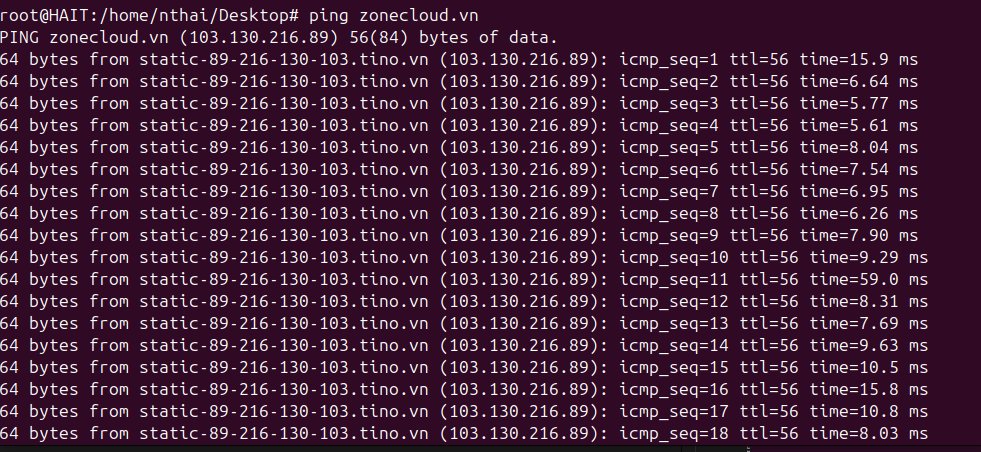
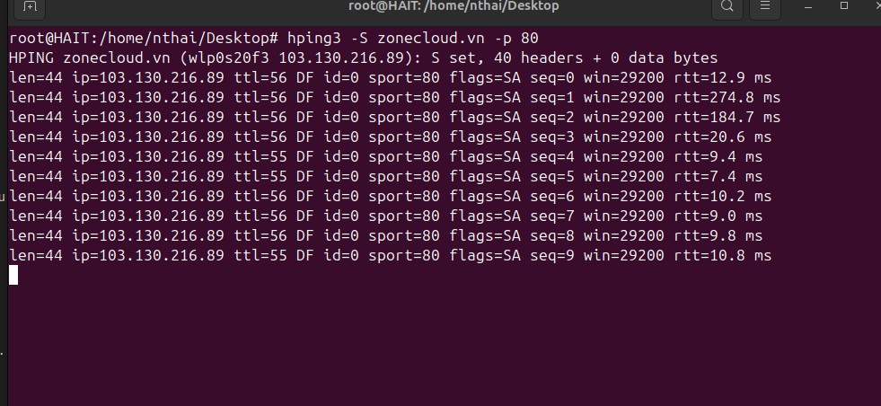
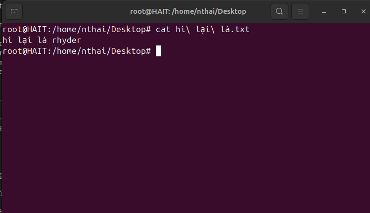
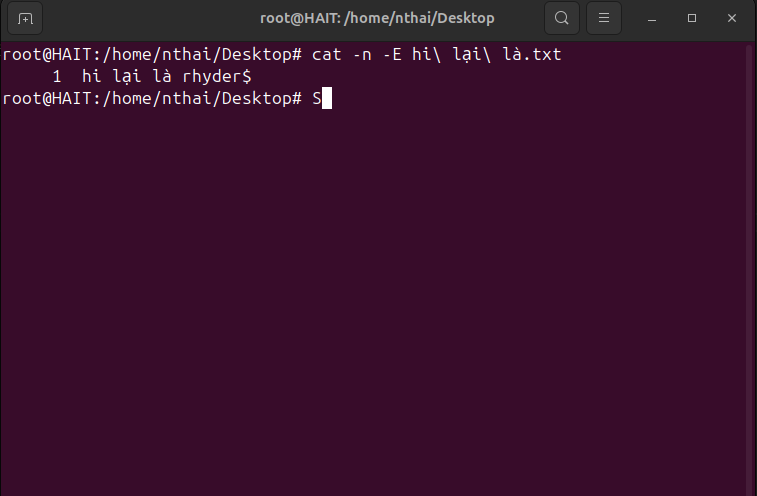

Command Line: 
Bài tập: Thực hành từng command và note lại quá trình chạy command đó. Vào file markdown và lưu tại: <name>/linux/linux-basic/commandLine.md

telnet command : là công cụ dòng lệnh dùng để kiểm tra và xử lý các kết nối mạng.
Sử dụng để kiểm tra và kết nối đến các dịch vụ mạng TCP đơn giản như HTTP, SMTP, FTP, v.v.

telnet [hostname or IP] [port]

nc command: Kết nối từ xa, kiểm tra dịch vụ, chuyển tiếp cổng, quét cổng, truyền tệp

nc [options] [hostname or IP] [port]

telnet đến port 22 của ip vps lab trả lời port có mở hay không

telnet đến port 20 của ip vps lab trả lời port có mở hay không

ping/hping3 ping đến domain zonecloud.vn sau đó giải thích

Ping zonecloud.vn

Kích thước gói tin: 64 bytes. Đây là kích thước của gói tin ICMP 

Địa chỉ IP và hostname của máy chủ phản hồi: 103.130.216.89 (static-89-216-130-103.tino.vn).

Số thứ tự gói tin: 1.

TTL của gói tin phản hồi: 56.

Thời gian hồi đáp từ máy chủ : 5.85 ms.
hping3 :   

hping3 -S zonecloud.vn -p 80

-S: Gửi gói SYN (SYN flag set).

zonecloud.vn: Tên miền hoặc địa chỉ IP của mục tiêu.

-p 80: Cổng đích là 80 (HTTP).

len=44: Chiều dài của gói tin là 44 bytes.

ip=103.130.216.89: Địa chỉ IP của máy chủ phản hồi.

ttl=52: Time to Live của gói tin phản hồi.

id=0: Identifier của gói tin.

sport=0: Cổng nguồn là 0 (do cổng đích mặc định là 0).

flags=RA: Các cờ trong gói tin phản hồi là RST-ACK (Reset and Acknowledge). Điều này thường xảy ra khi cổng đích không mở hoặc không có dịch vụ nào lắng nghe trên cổng đó.
seq=0, 1, 2: Số thứ tự của các gói tin.

win=0: Kích thước cửa sổ TCP là 0.

rtt=49.9 ms, 50.1 ms, 50.2 ms: Round-trip time - thời gian hồi đáp của các gói tin, tính 
bằng milliseconds (ms).

ttl= là gì?

Time to Live (TTL) là giá trị cho biết số lượng bước nhảy (hops) mà gói tin có thể đi qua trước khi bị loại bỏ. Mỗi khi gói tin đi qua một router, giá trị TTL sẽ giảm đi một đơn vị. Nếu TTL giảm về 0, gói tin sẽ bị loại bỏ. TTL có thể cung cấp thông tin về số lượng router mà gói tin đã đi qua từ máy gửi đến máy nhận.

time= là gì? 

Đây là thời gian hồi đáp (round-trip time) của gói tin, tính bằng milliseconds (ms). Thời gian này đo lường khoảng thời gian từ khi gói tin được gửi đi cho đến khi nhận được phản hồi từ máy chủ. 
vd:         Giá trị thấp (như 5.85 ms) cho thấy kết nối mạng giữa máy của bạn và máy chủ zonecloud.vn rất nhanh và ổn định.

ssh command

Dùng password: Khóa SSH cung cấp một cách an toàn hơn để kết nối với máy chủ so với mật khẩu. Để sử dụng khóa SSH, trước tiên bạn cần tạo một cặp khóa SSH và thêm khóa công khai vào máy chủ từ xa.

ssh username@remote_host

Dùng key: 

ssh-keygen -t rsa -b 4096 -C "your_email@example.com"

ssh -i /path/to/private_key username@remote_host

ssh-copy-id username@remote_host

Dùng port custom

ssh -p port_number username@remote_host

ssh -i /path/to/private_key -p port_number username@remote_host

scp command : Lệnh scp (Secure Copy) được sử dụng để sao chép các tệp tin và thư mục giữa các máy tính từ xa một cách an toàn qua mạng. Dưới đây là cách sử dụng scp để sao chép một tệp tin và một thư mục.

scp 1 file : 

Từ máy - máy từ xa : scp /path/to/local/file username@remote_host:/path/to/remote/destination

Từ máy từ xa - máy  :scp username@remote_host:/path/to/remote/file /path/to/local/destination

scp 1 folder: 

Từ máy - máy từ xa : scp -r /path/to/local/folder username@remote_host:/path/to/remote/destination

Từ máy từ xa - máy : scp -r username@remote_host:/path/to/remote/folder /path/to/local/destination

 Nếu là port khác : 
scp -P port_number /path/to/local/file username@remote_host:/path/to/remote/destination

rsync command : 
Lệnh rsync được sử dụng để đồng bộ hóa và sao chép tệp tin và thư mục giữa các máy tính từ xa hoặc trong cùng một hệ thống. rsync có khả năng đồng bộ hóa chỉ những phần thay đổi, giúp tiết kiệm băng thông và thời gian. Dưới đây là cách sử dụng rsync để sao chép tệp tin, thư mục, và thực hiện đồng bộ hóa gia tăng (incremental synchronization).

rsync file : 
Từ máy - máy từ xa: rsync -avz /path/to/local/file username@remote_host:/path/to/remote/destination

Từ máy từ xa - máy:rsync -avz username@remote_host:/path/to/remote/file /path/to/local/destination

rsync folder : 
Từ máy - máy từ xa:rsync -avz /path/to/local/folder username@remote_host:/path/to/remote/destination

Từ máy từ xa - máy:rsync -avz username@remote_host:/path/to/remote/folder /path/to/local/destination

rsync increamental : tự động thực hiện đồng bộ hóa gia tăng, nghĩa là nó chỉ sao chép các tệp tin đã thay đổi hoặc mới. Cú pháp sử dụng vẫn như các ví dụ trên. 

Các tùy chọn thường dùng:

    -a : Archive mode, đồng bộ hóa toàn bộ thư mục và giữ nguyên thuộc tính của tệp tin.
    -v : Verbose, hiển thị thông tin chi tiết quá trình sao chép.
    -z : Compress, nén dữ liệu trong quá trình truyền để tiết kiệm băng thông.
    --delete : Xóa các tệp tin ở đích mà không còn tồn tại ở nguồn, giúp đồng bộ hóa hoàn toàn.

rsync -avz --delete /path/to/local/folder username@remote_host:/path/to/remote/destination

rsync -avz -e "ssh -p port_number" /path/to/local/file_or_folder username@remote_host:/path/to/remote/destination

cat command: Lệnh cat (concatenate) trong Linux được sử dụng để hiển thị nội dung của tệp tin, kết hợp nhiều tệp tin và chuyển nội dung vào tệp tin khác.

cat nội dung 1 file 

cat /path/to/file

cat dòng thứ <n> trong file

cat -n -E file.txt

cat nhiều dòng vào 1 file bằng EOF:
EOF là ký tự được khai báo và dùng để kết thúc việc nhập liệu, có thể sử dụng một chuỗi bất kỳ thay thế.

echo command

Dùng echo để chèn thêm 1 dòng vào cuối file

Dùng echo để overwirte nội dung của file
h
tail/head command

tail và tailf

sed command

Dùng sed để find and replace một string trong file

traceroute/tracert command

Sau khi traceroute xong giải thích chi tiết kết quả trả về

netstat command

hiển thị các socket đang listen

don't resolve hostname

don't resolve portname

display process name/PID

only show tcp socket

only show udp socket

sort command

sort theo thứ tự tăng dần

sort theo thứ tự giảm dần

sort theo column

uniq command

lọc ra các dòng lặp lại trong một file

lọc ra các dòng lặp lại trong file và đếm số lượng các dòng lặp lại

wc command

Đếm số dòng trong file

Đếm số kí tự trong file

chmod, chown, chattr command

Phân quyền bằng số, phân quyền bằng chữ

Đổi owner user/group

Set Immutable Attribute

find command

find các file có đuôi .log

find các folder có tên abc

find các file có tên abc

find các file có tên abc và thực hiện phần quyền read only cho file

